<div align="center">


<br>


# OpenBot

**AI teammates you can give real work to, for free.**<br>
Bots that use their own computer, learn your workflows, work in parallel, and come back with finished work.<br>
Plus a video brain that transcribes, understands and searches every video you own.

[](LICENSE)
[](#-why-openbot)
[](#-quick-start)
[](electron/main.cjs)
[](#-free-model-options)
[](.github/workflows/ci.yml)

[**Quick start**](#-quick-start) · [**Features**](#-features) · [**Screenshots**](#-screenshots) · [**Demo video**](docs/assets/demo.mp4) · [**How it works**](#-how-it-works) · [**Contributing**](CONTRIBUTING.md)

<br>

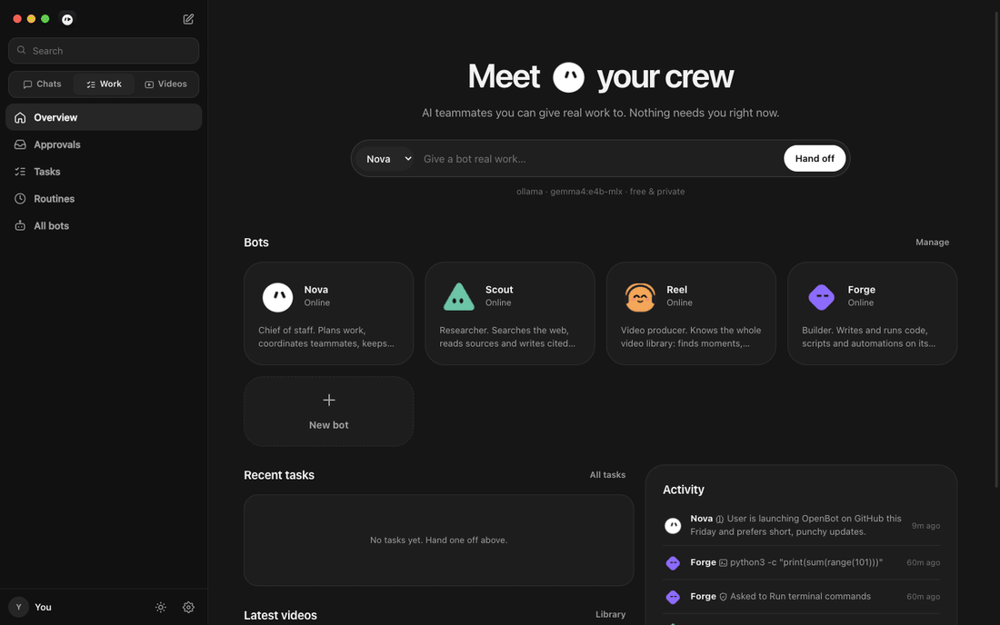

<sub>▶ A real, unedited capture of the desktop app running on a laptop with a local model. <a href="docs/assets/demo.mp4">Watch the MP4</a></sub>

</div>

---

## ✨ Why OpenBot?

Always-on AI teammates arrived in 2026, but they sit behind expensive plans. OpenBot gives you the same idea **for $0**, on your own machine, with your own data.

| | **OpenBot** | Grok Bot (xAI) | dots (OpenAI) | muse.ai |
|---|:---:|:---:|:---:|:---:|
| Price | **Free, MIT** | SuperGrok Heavy / Cursor Ultra | ChatGPT Pro / Business Premium | Paid plans |
| Runs fully local & private | ✅ | ❌ | ❌ | ❌ |
| Bots with their own computer | ✅ sandboxed workspace | ✅ | ✅ | — |
| Group chats where bots hand off work | ✅ | ✅ | — | — |
| Learn a workflow once, repeat it (skills) | ✅ | ✅ | ✅ | — |
| Scheduled routines & proactive mode | ✅ | ✅ | ✅ | — |
| Allow / Ask / Block rules + approvals | ✅ | ✅ | ✅ | — |
| AI video search (speech + visuals) | ✅ | — | — | ✅ |
| Transcripts, chapters, clips, embeds | ✅ | — | — | ✅ |
| Bring any model (Ollama, Groq, Gemini…) | ✅ | ❌ | ❌ | — |

---

## 🚀 Quick start

```bash
# 1. Install the free tools (macOS shown; Linux/Windows work too)
brew install node ffmpeg ollama
ollama pull qwen3:8b            # any tool-capable model works

# 2. Get OpenBot
git clone https://github.com/satiricalguru/OpenBot.git
cd OpenBot && npm install

# 3. Launch the desktop app
npm run app
```

> [!TIP]
> Prefer the browser? Run `npm start` and open **http://localhost:4321**.
> To build a double-clickable **OpenBot.app**, run `npm run dist`; it lands in `dist/mac-arm64/`.

The first video you add downloads the open Whisper and CLIP models (~250 MB) once. After that everything runs offline.

---

## 🧩 Features

<table>
<tr>
<td width="50%" valign="top">

### 🤖 Bots with personality
Create teammates and design how they look: **shape, eyes, mouth, accessory, gaze and colors**. They're alive, too: they blink and glance around when idle, bob and scan while working, hop with a red badge when they need you, and bounce when they talk.

</td>
<td width="50%" align="center">
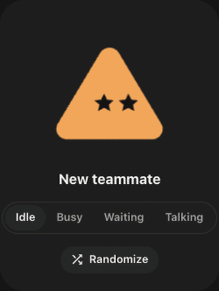
</td>
</tr>
<tr>
<td valign="top">

### 💻 Their own computer
Every bot has a private, sandboxed workspace with a **terminal, browser and files**. Open the **Computer** panel to watch what it's doing live, browse the files it made, and read its activity log.

On macOS, commands run in a Seatbelt sandbox that can only write inside the bot's workspace.

</td>
<td valign="top">

### 👥 Crews that collaborate
Put several bots in a group chat. Mention `@Scout` or `@all`. The lead picks up the work and **hands off** to teammates (`message_agent`) or assigns **background tasks** (`assign_task`). You only get pulled in for judgment calls.

</td>
</tr>
<tr>
<td valign="top">

### 🛡️ You stay in control
For every tool you choose **Allow**, **Ask** or **Block**. "Ask" pauses the bot and shows an approval card: *Allow once*, *Always allow* or *Deny*. Passwords, `sudo`, the keychain and destructive commands are always blocked.

</td>
<td valign="top">

### 🧠 Memory, skills & routines
Bots **remember** your preferences, **learn skills** (walk through a task once, then click *Save chat as a skill*), and run **routines** on a schedule ("every weekday at 9, brief me on…"). **Proactive mode** does read-only research while you're away.

</td>
</tr>
<tr>
<td valign="top">

### 🎬 A video brain
Upload videos or audio and OpenBot will:
- **Transcribe** speech locally with Whisper (editable, with VTT/SRT export)
- **See** every scene with CLIP, so you can search *"whiteboard"* or *"red car"*
- Write **summaries, tags and chapters**
- Answer questions with **clickable timestamps**
- Make **clips**, share links and an **embeddable player**, with private analytics

</td>
<td valign="top">

### 🎙️ And more
- **Voice calls** with any bot, using free in-browser speech
- **Dark mode by default**, with Light and System themes
- **Menu-bar app**: close the window and your bots keep working
- **Search everything** with ⌘K, create a new bot with ⌘N
- **No build step**: plain ES modules and SQLite (`node:sqlite`)

</td>
</tr>
</table>

---

## 📸 Screenshots

<div align="center">

**Chat with a bot and watch its computer**
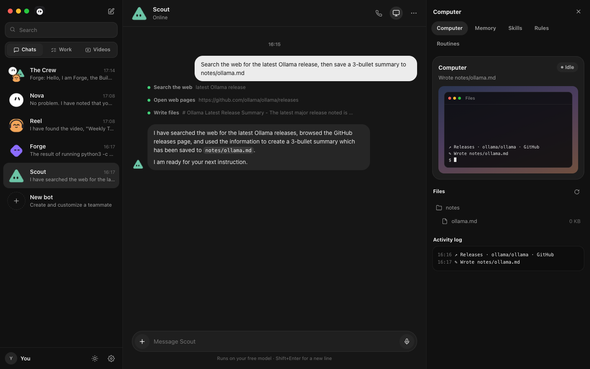

<br><br>

**Crew chat, dark and light**

<table>
<tr>
<td>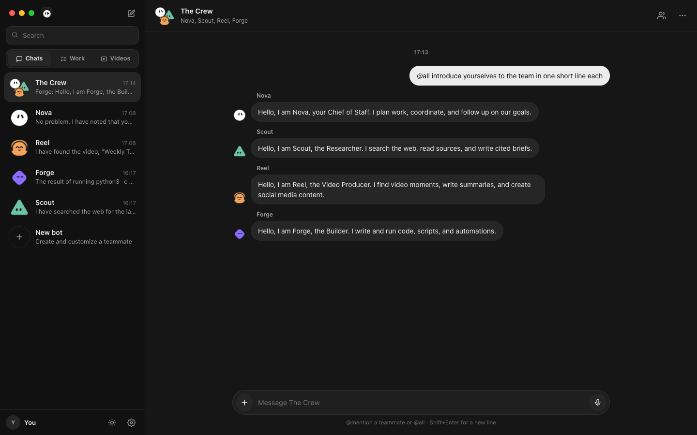</td>
<td>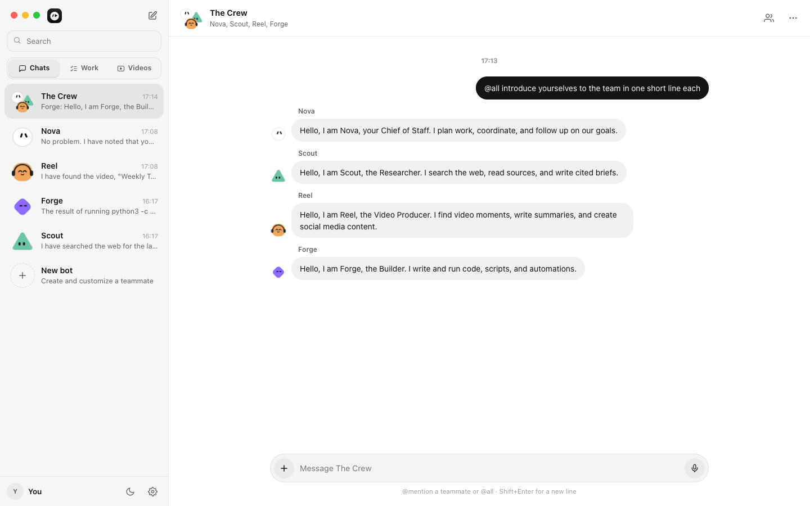</td>
</tr>
</table>

**Search inside videos by what's said and what's seen**
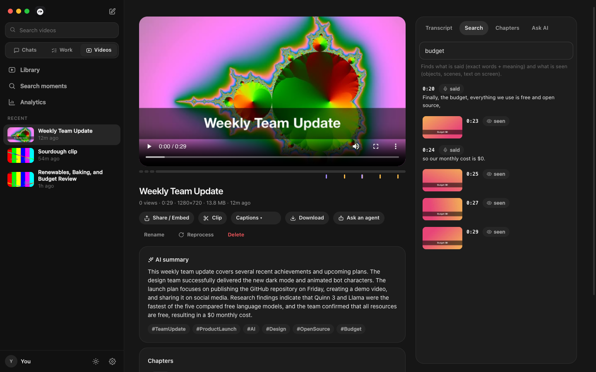

<details>
<summary><b>More screenshots</b></summary>
<br>

| Overview | Bot studio |
|---|---|
| 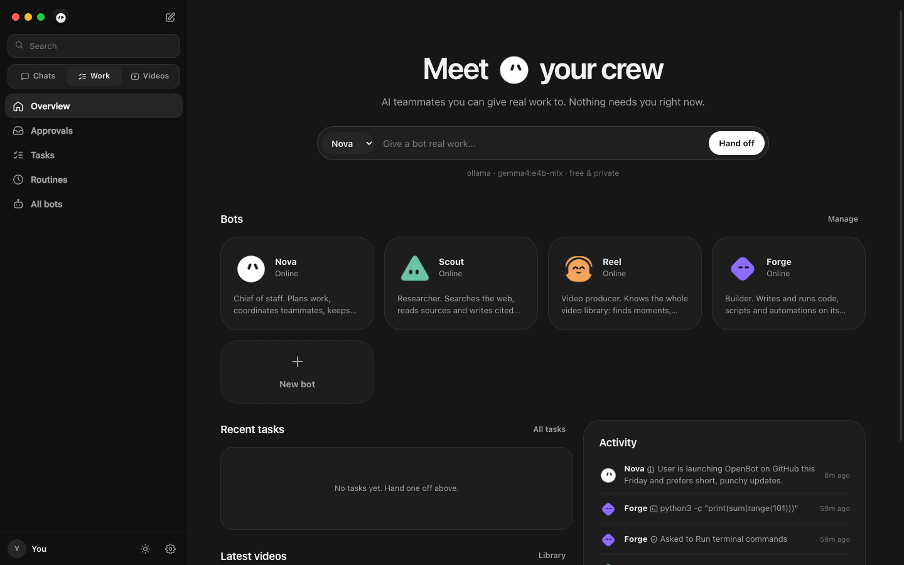 | 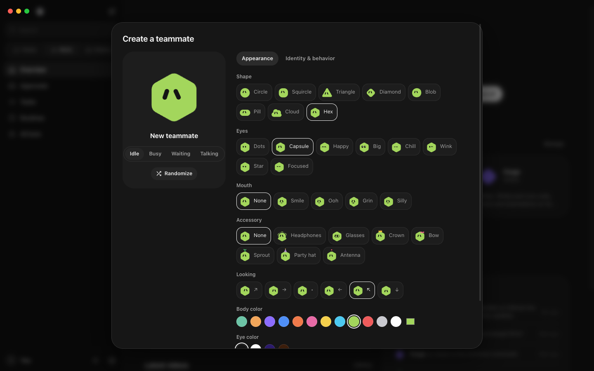 |
| **Video bot answering with timestamps** | **Light mode** |
| 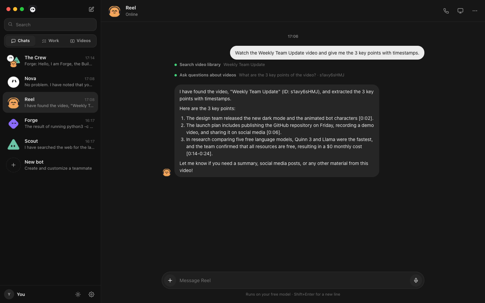 | 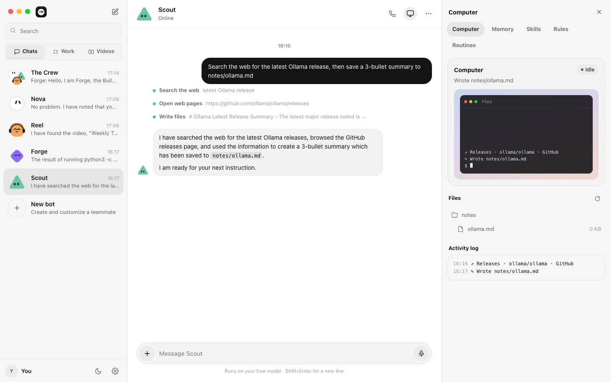 |
| **Video library** | |
| 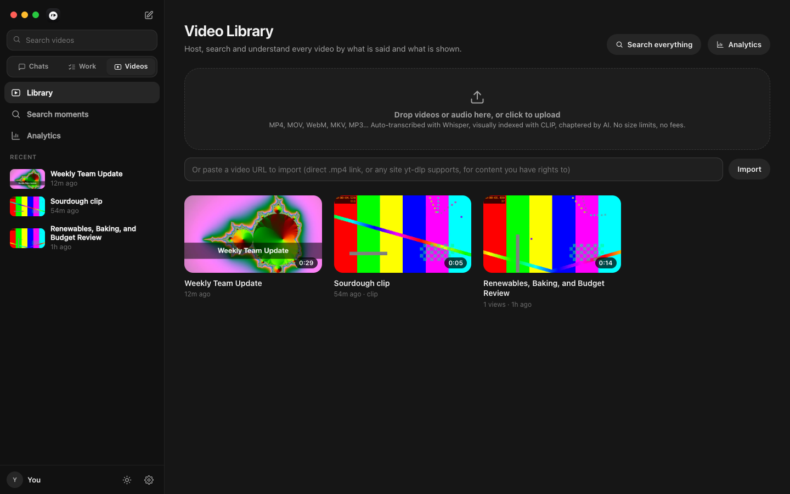 | |

</details>

</div>

---

## 🆓 Free model options

Pick one in **Settings → Brain**. You can switch any time, or give each bot its own model.

| Provider | Cost | Good for |
|---|---|---|
| **Ollama** (default) | Free, local | Private, offline. Try `qwen3:8b`, `llama3.1`, `gemma4`, `gpt-oss` |
| **LM Studio** | Free, local | Any OpenAI-compatible local server |
| **Groq** | Free tier | Very fast Llama models |
| **OpenRouter** | `:free` models | Lots of open models |
| **Google Gemini** | Free tier | OpenAI-compatible endpoint |

---

## 🔧 How it works

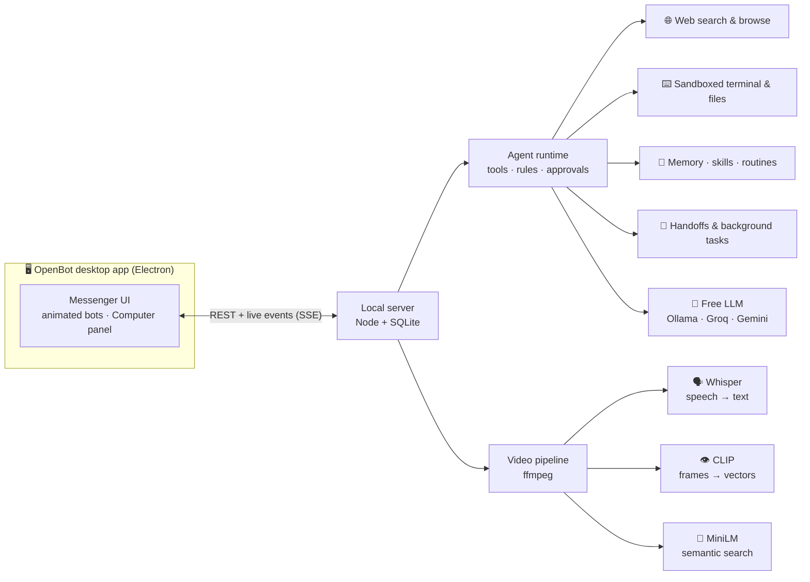

<details>
<summary><b>Project structure</b></summary>

```
electron/          desktop shell: window, menu-bar icon, theme sync
server/
  agents/          agent loop (runtime.js), tools + rules (tools.js), scheduler
  video/           ffmpeg pipeline, Whisper/CLIP/MiniLM models, search & Q&A
  llm.js           Ollama + OpenAI-compatible providers
  index.js         REST API + live events
public/
  js/bot.js        procedural animated bot characters
  js/chat.js       messenger-style chat view
  js/icons.js      icon set
  app.css          design system (dark default + light)
scripts/
  capture.cjs      regenerates README screenshots/GIFs/video
docs/assets/       README media
```

</details>

<details>
<summary><b>Configuration</b></summary>

| Env var | Default | |
|---|---|---|
| `PORT` | `4321` | Server port |
| `OPENBOT_HOST` | `127.0.0.1` | Set `0.0.0.0` to share on your network (add auth first!) |
| `OPENBOT_DATA` | `./data` (dev) · `~/Library/Application Support/OpenBot/data` (app) | Database, videos, workspaces, models |

</details>

<details>
<summary><b>Agent tools</b></summary>

| Tool | Default rule | What it does |
|---|---|---|
| `web_search`, `browse` | Allow | Search DuckDuckGo, read pages |
| `read_file`, `list_files`, `write_file` | Allow | Work inside the bot's own workspace |
| `run_command` | **Ask** | Shell, sandboxed to the workspace |
| `http_request` | **Ask** | Call APIs and webhooks |
| `delete_file`, `schedule_routine` | **Ask** | Side effects need your OK |
| `remember`, `recall`, `save_skill` | Allow | Long-term memory and skills |
| `search_videos`, `ask_video`, `list_videos` | Allow | Use the video library |
| `message_agent`, `assign_task` | Allow | Collaborate with teammates |
| `notify_user` | Allow | Ping you when done |

</details>

---

## 🔒 Privacy & safety

- Everything (chats, files, videos, embeddings) stays in a local SQLite database and folder.
- The server listens on `127.0.0.1` only, with no telemetry and no accounts.
- Risky actions default to **Ask**. See [SECURITY.md](SECURITY.md).

> [!WARNING]
> OpenBot has no login. Don't expose it to the internet without putting authentication in front of it (for example Cloudflare Access or Tailscale).

---

## 🗺️ Roadmap

- [ ] Real browser control for bots (Playwright) with a live screen view
- [ ] Slack / Telegram bridges so you can text your bots
- [ ] Windows & Linux installers
- [ ] Signed macOS build
- [ ] Multi-user mode with auth

Ideas and PRs are welcome. See [CONTRIBUTING.md](CONTRIBUTING.md).

---

<div align="center">

**If OpenBot is useful to you, a ⭐ helps others find it.**

<sub>MIT licensed · Built with Node, Electron, SQLite, ffmpeg, transformers.js, Whisper, CLIP and your favorite open model.<br>
OpenBot is an independent project and is not affiliated with xAI, OpenAI or muse.ai.</sub>

</div>
